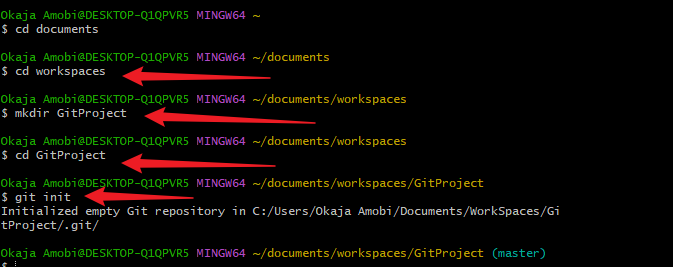
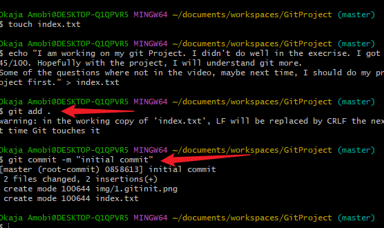
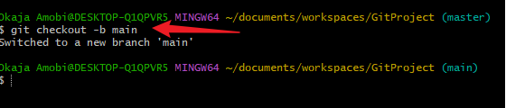
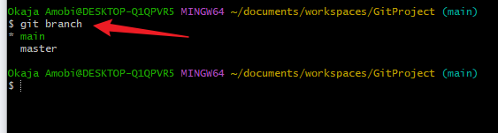
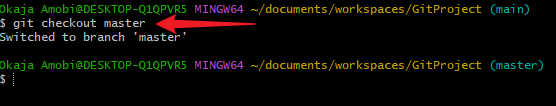
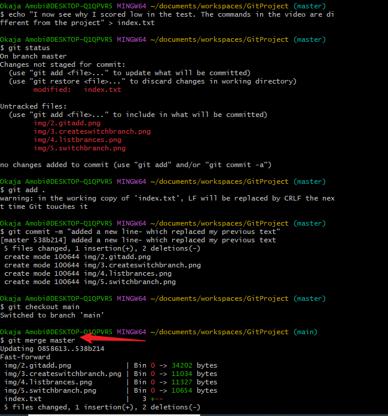
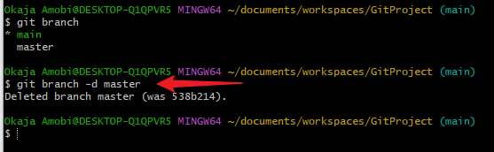
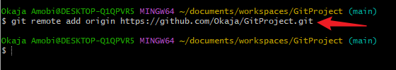
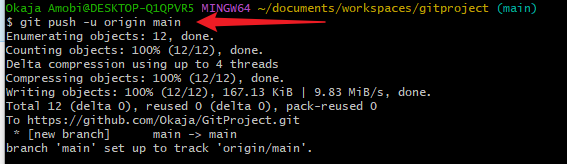
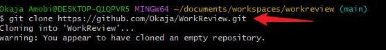

# Git Project
## Initializing a Git Repository

The git init command is used for the initial set up of a new repository. This command creates a new .git subdirectory the current working directory. It also create a new branch.

- syntax git init

## Making a Commit
A commit helps us save the changes which we made in our file. Such changes includes: adding, modifying or deleteing files or text. When we commit, git saves a copy of our file the .git folder inside the working directory
- syntax git commit -m "message"

- The -m flag is very important for every commit. It is used to specify information about the commit. It should be as descriptive as possible

## Create a Branch
Git branch helps create a different copy of your source code. 

- syntax: git checkout -b my-new-branch

## List Branch
This command is used to make a list of branches on the local repository

- syntax: git branch

## Change into an Old Branch

-syntax  git checkout branch-name

## Merging a Branch into another Branch
This command enables us merge a branch into another branch

-syntax   git merge B

## Deleting a git branch
To delete a branch we use the command below

- syntax   git branch -d branch-name

## Pushing Your Local git Repository to Remote github Repository

### Add a remote repository to the local repository

- syntax: git remote add origin link-to-your-github-repo

### Pushing your local repost to your remote repos
Once the changes to your code has been commited to your local repository we push the content to the remote repo.

- syntax: git push origin branch name

### Cloning Remote Git Repository 

The clone command is used to make a local copy of an existing remote repos. This is very useful for colloboration with other team members

# Branch Management and Tagging

## Markdown Syntax
This is a lightweight markup language that is used for formatting plain text. Markdown is commonly used for creating documents, README files, forum files post and web pages

1. Headings: These are used to create heading, using the hash symbol at the beginning of the line. The number of has symbol used indicate the level of the heading

- Example:

# Heading 1
## Heading 2
### Heading 3

2. Emphasis:asterisks or underscore is used to Emphasis text. 
- Examples

    *italic* or _italic_

    **Bold** or __Bold__

3. Lists: This markdown support both ordered and unorder list

- Unordered List example:
- item 1
- item 2
- item 3

- Ordered List  Example:
1. School book
2. School shoes
3. School bag

4. Link:This is used to create a hyperlink, use square brackets for the link text followed by parentheses containing the URL
[visit darey.io](https://www.darey.io)

5. Images: This is used to display an image. An exclamation mark followed by square brackets for the alt text and parentheses containin the image url

6. Code: This is used to display code or code snippets, the backticks(~) to enclose the code

`console.log('Welcome to darey.io')`

